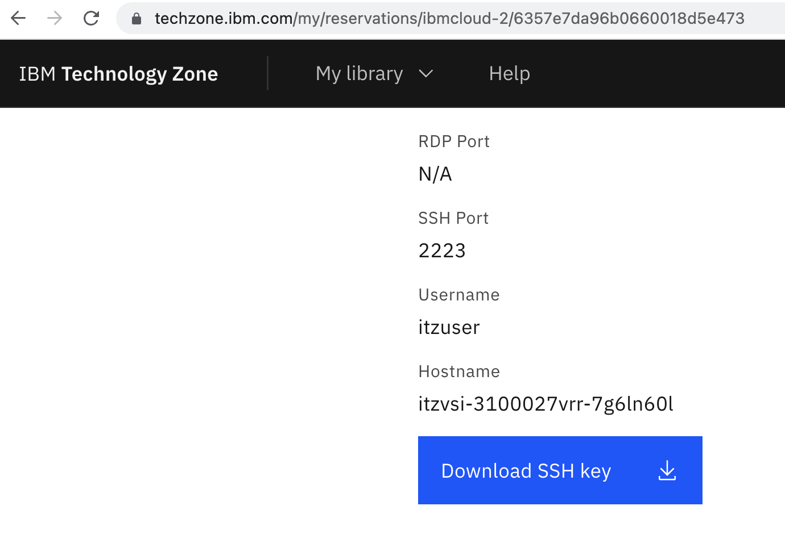
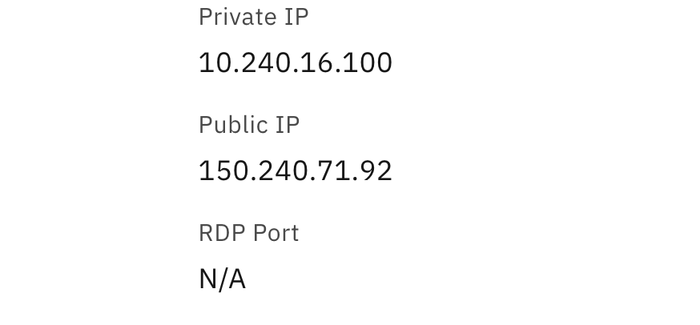
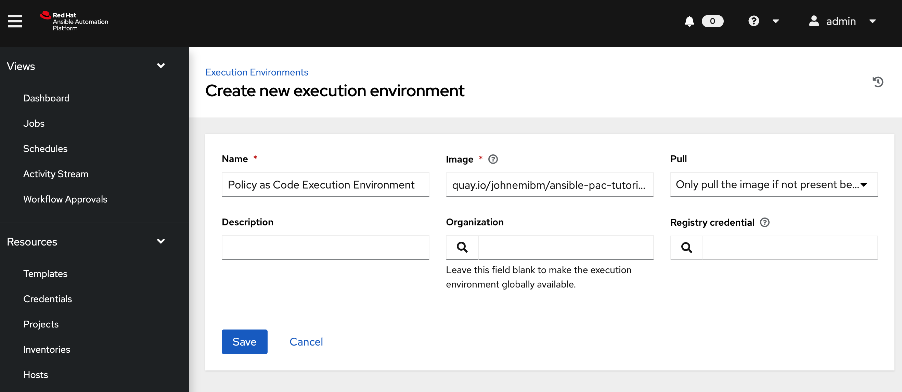
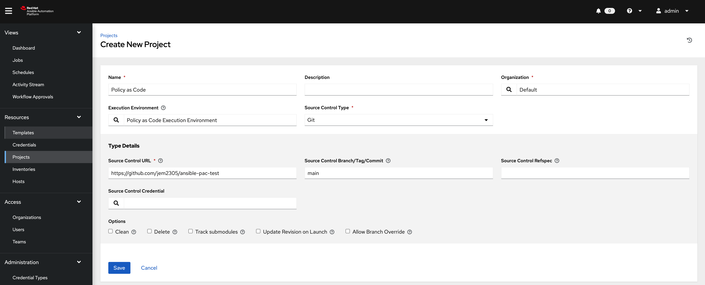

# Ansible Policy as Code Tutorial

This tutorial assumes the user is running Mac OS environment, commands for Windows users will be provided at a later time. If you are a Windows user, please use the equivalent commands for your operating system.

## TechZone VM Provisioning

1. Use the base image here from here [RHEL 8.6 VSI on IBM Cloud](https://techzone.ibm.com/my/reservations/create/62ab7e6c79c3250017398d8b)

1. Once the VM is provisioned, you will receive an email with a link to the Tech Zone reservation. There you will find details such as IP address and a link to download the SSH private key.

    

1. Once you have downloaded the key, note the key name. If you have previously downloaded keys, it may contain a postfix such as `(1)`, e.g. `pem_ibmcloudvsi_download (1).pem`. Then, run the following commands to move the key to your `.ssh` directory, updating the key name accordingly.

    ```shell
    mv ~/Downloads/pem_ibmcloudvsi_download\ \(1\).pem ~/.ssh/policy_as_code_tutorial.pem

    chmod 400 ~/.ssh/policy_as_code_tutorial.pem
    ```

1. Then, set the `TZ_AAP_IP_ADDRESS` shell environment variable with the public IP address of your VM from Tech Zone. E.g. given the IP address `150.240.71.92`, the command would be:

    

    ```shell
    export TZ_AAP_IP_ADDRESS="150.240.71.92"
    ```

## Install Ansible Automation Platform

### Obtain Ansible Automation Platform Software

1. Download the Ansible Automation Platform bundle here [AAP Bundle Download](https://developers.redhat.com/products/ansible/download)

1. Once you have downloaded, note the bundle name & version e.g. `ansible-automation-platform-setup-bundle-2.2.0-8.1.tar.gz` then, run the following commands while updating bundle name and version accordingly.

    ```shell
    scp -i ~/.ssh/policy_as_code_tutorial.pem -P 2223 ~/Downloads/ansible-automation-platform-setup-bundle-2.2.0-8.1.tar.gz itzuser@${TZ_AAP_IP_ADDRESS}:ansible-automation-platform-setup-bundle-2.2.0-8.1.tar.gz

    ```

### Install Single Node

1. SSH into the Tech Zone VM, unpack the software, and enter the directory.

    ```shell
    ssh -i ~/.ssh/policy_as_code_tutorial.pem -p 2223 itzuser@${TZ_AAP_IP_ADDRESS}

    tar -xvzf ansible-automation-platform-setup-bundle-2.2.0-8.1.tar.gz

    cd ansible-automation-platform-setup-bundle-2.2.0-8.1
    ```

1. Modify the `inventory` file to the following contents, where `10.X.X.X`  is the private IP address of your machine e.g. `10.240.16.100`.

    

    ```toml
    [automationcontroller]
    10.X.X.X ansible_connection=local

    [database]

    [all:vars]
    admin_password='password'

    pg_host=''
    pg_port=''

    pg_database='awx'
    pg_username='awx'
    pg_password='password'
    ```

1. Run the installation scripts as `root` user to install Ansible Automation Platform.

    ```shell
    sudo su

    ./setup.sh

    exit
    ```

1. Once installation is finished, you may then log into Ansible Automation Platform by pasting the public IP of your VM into a browser. Then enter the credentials U: `admin` P: `password`

### Register Subscription

[Subscription Asset Manager](https://access.redhat.com/management/subscription_allocations)

## Install Open Policy Agent (Podman)

1. Create a file `~/opa/config.yaml` with the following contents:

    ```yaml
    services:
       - name: cos-us-south
           url: https://s3.us-south.cloud-object-storage.appdomain.cloud

    bundles:
        authz:
            service: cos-us-south
            resource: policyascodejm/bundle.tar.gz
            polling:
            min_delay_seconds: 10
            max_delay_seconds: 20
    ```

2. On the Ansible Automation Platform VM, run the following command to start Open Policy Agent

    ```shell
    podman run --name opa -v ~/opa:/config -d --publish 8181:8181 --restart always docker.io/openpolicyagent/opa:0.45.0-rootless run --server -c /config/config.yaml
    ```

## Initialize Policy as Code Execution Environment

### Create Quay.io Registry

[Quay.io](https://quay.io)

### Build Image

1. Login to the Red Hat Registry & Quay.io Registry

    ```shell
    podman login registry.redhat.io
    Username: <rhusername>
    Password: ***********

    podman login quay.io
    Username: <quayiousername>
    Password: ***********
    ```

1. Build the image

    ```shell
    podman build -t quay.io/<quayiousername>/ansible-pac-tutorial:0.0.1 --arch amd64 .
    podman build -t quay.io/johnemibm/ansible-pac-tutorial:ibmcloud-0.0.1 --arch amd64 -f Dockerfile.ibmcloud .

    podman push quay.io/<quayiousername>/ansible-pac-tutorial:0.0.1
    ```

### Add Execution Environment

Login to your Ansible Automation Platform and navigate to 'Administration -> Execution Environments' and create execution environment accordingly.



### Create API Key in IBM Cloud

### Add API Key to Ansible Automation Platform

In Ansible Automation Platform, create a new Credential Type for IBM Cloud by performing the following steps.

1. Navigate to 'Administration -> Credential Types'

1. Click 'Add', enter the following values, then save.

    **Name:** Terraform IBM Cloud Provider

    **Input Configuration:**

    ```yaml
    fields:
    - id: api_key
        type: string
        label: IBM Cloud API Key
        secret: true
    required:
    - api_key
    ```

    **Injector Configuration:**

    ```yaml
    env:
      IC_API_KEY: '{{ api_key }}'
    ```

1. Navigate to 'Resources -> Credentials', click 'Add' button, enter the following values, then save.

    **Name:** IBM Cloud API Key

    **Credential Type:** Terraform IBM Cloud Provider

    **IBM Cloud API Key:** [Your IBM Cloud API Key]

### Create Policy as Code Project

1. TODO: Clone repo on git

1. Create the project similar to the following, make sure to select the Policy as Code execution environment created in the last step.

    
